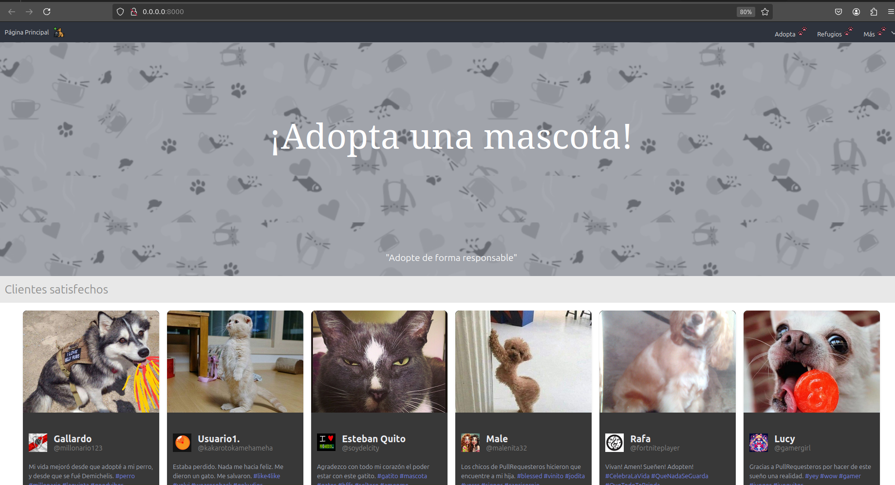
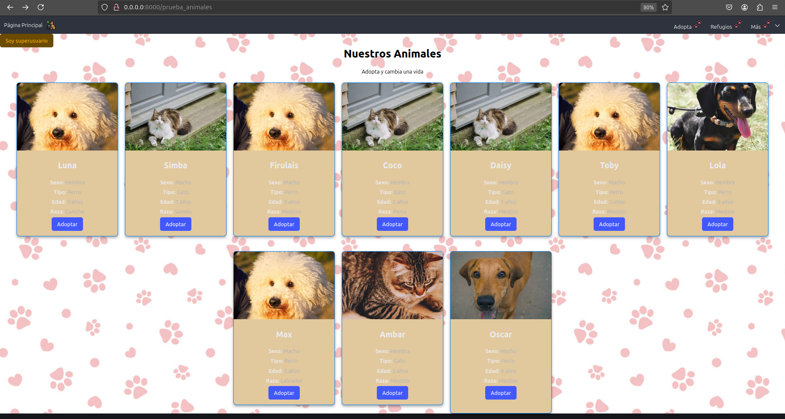
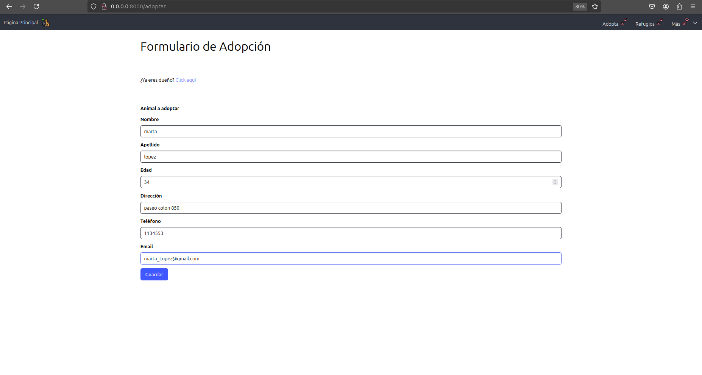

# Portal Adopción de Mascotas

El siguiente proyecto es un servidor para gestionar la adopción de animales como perros y gatos. 

### Funcionalidades:
- **Listado de animales** disponibles para adopción.
- **Detalles de cada animal**, incluyendo su nombre, especie, edad, sexo y más.
- **Formulario para solicitar la adopción** de un animal.
- **CRUD** para las entidades de animales, adoptantes y refugios.

## Tecnologías Usadas
- **Frontend**: HTML, CSS, JavaScript (CSR)
- **Backend**: Node.js, Express.js
- **Base de Datos**: PostgreSQL con Prisma ORM
- **Docker**: Contenedores para el backend y el frontend
- **Control de versiones**: Git


## Funcionamiento

Capturas de pantalla del proyecto.

### Página de inicio
A continuación, se muestra la página principal del sitio donde los usuarios pueden ver experiencias de clientes pasados.



### Adoptar animal
Esta es la página que muestra los los animales disponibles para adopción y sus características.
A ella se accede por el apartado "Adopta" de la barra superior.



### Formulario de solicitud de adopción
Al presionar adoptar, se redirige al usuario hacie el formulario para que los usuarios puedan solicitar la adopción de un animal.




## Requisitos

Antes de ejecutar este proyecto, asegúrate de tener instalados los siguientes programas:

1. **Node.js**: [Descargar Node.js](https://nodejs.org/)
2. **Docker**: [Descargar Docker](https://www.docker.com/get-started)
3. **Prisma CLI**: Para gestionar la base de datos, se usa Prisma. Debes tenerlo instalado:
    ```bash
    npm install @prisma/client
    ```

## Instalación

### 1. Clonar el repositorio
Clona el repositorio del proyecto:
```bash

Para levantar la parte del backend vamos a la terminal y entramos a la carpeta del backend, ahi dentro escribimos docker compose up -d, lo que hara esto es levantar un contenedor y si no lo tiene lo creara descargando todo. luego escribimos npm install para descargar las dependencias necesarias y luego 'npx prisma migrate' para ejecutar las migraciones de todo el proyecto. La ultima parte es hacer 'npm run dev', el adentro de dev esta 'nodemon src/app.js',esto inicia el servidor y si detecta cambios se reinicia automaticamente. 

Para levantar la parte del frontend:
Primero se debe entrar en la carpeta del 'frontend' y luego escribir en terminal npm install serve, es una dependecia que permite levantar servideores, luego ponemos 'npm run start' para iniciar y levantar nuestro servidor. 

git clone https://github.com/SilvinaVilchez23/Pull-Requesteros.git

### Licencia
Este proyecto está bajo la Licencia MIT. Ver el archivo [LICENSE](./LICENSE) para más detalles.


